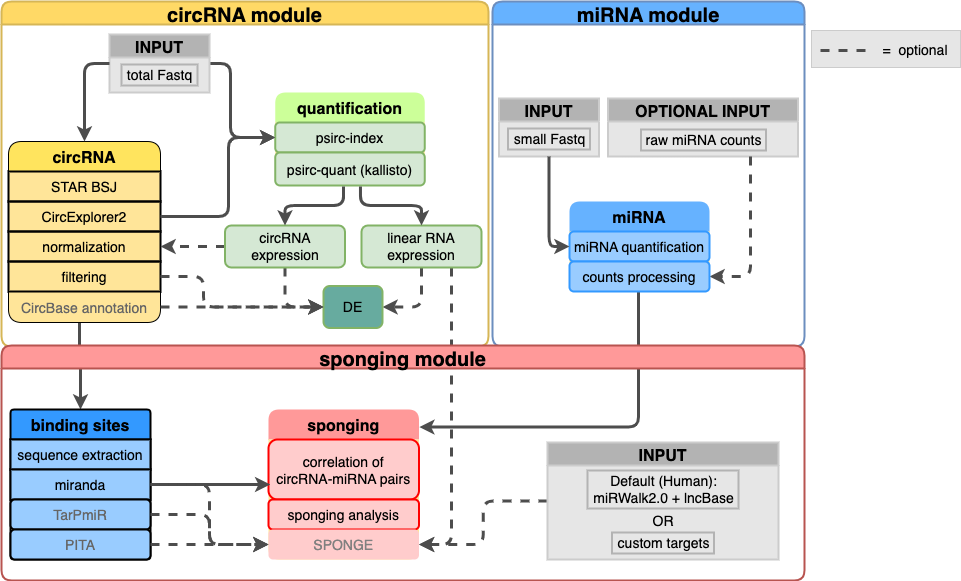

# 

**Analysis of circRNA and miRNA sponging**.

<!--[](https://github.com/nf-core/circrnasponging/actions)
[](https://github.com/nf-core/circrnasponging/actions)
[](https://www.nextflow.io/)

[](https://bioconda.github.io/)
[](https://hub.docker.com/r/nfcore/circrnasponging)
[](https://nfcore.slack.com/channels/circrnasponging)-->

This pipeline was implemented by Octavia Ciora as part of her Advanced Lab Course Bioinformatics under the supervision of Dr. Markus List.
It was extended by Leon Schwartz as part of his Bachelor's Thesis under the supervision of Markus Hoffmann and Dr. Markus List.

## Table of Contents

* [Introduction](#introduction)
* [Pipeline Summary](#pipeline-summary)
* [Documentation](#documentation)
  + [Basic Workflow](#basic-workflow)
  + [Input Files](#input-files)
  + [Additional Features and Advanced Options](#additional-features-and-advanced-options)
  + [Output](#output)
* [Pipeline Execution and Configuration](#pipeline-execution-and-configuration)

## Introduction

**nf-core/circrnasponging** is a pipeline for the systematical analysis of circRNAs, their differential expression, miRNA sponging activities and ceRNA network functions. It requires total RNA and small RNA sequencing data.

The pipeline is built using [Nextflow](https://www.nextflow.io), a workflow tool to run tasks across multiple compute infrastructures in a very portable manner. It comes with docker containers making installation trivial and results highly reproducible.

## Pipeline Summary

By default, the pipeline currently performs the following:
* circRNA analysis:
  + totalRNA back-splicing-junction (BSJ) mapping (using `STAR`)
  + circRNA detection (using `circExplorer2`)
  + aggregation of detected circRNAs over all samples, normalization and filtering
  + linear and circular quantification (using `psirc` and `kallisto`)
  + extraction of fasta sequences for filtered circRNAs
  + database annotation (using `circBase`)
* differential expression analysis (using `DESeq2`):
  + linear RNAs
  + circular RNAs
  + Heatmaps, Volcano and PCA plots
* miRNA analysis:
  + smallRNA read mapping and quantification (using `miRDeep2`)
  + aggregation of identified miRNAs over all samples, normalization and filtering
* circRNA-miRNA binding sites:
  + binding sites processing and filtering (`miRanda`)
  + `TarPmiR`
  + `PITA`
  + majority vote (2/3) for downstream analyses
* sponging analyses:
  + Correlation analysis between circRNA and miRNA expression (using `miRanda`)
  + mRNA-circRNA-miRNA networks (using majority vote with `SPONGE`)
  + ceRNA network analysis (using `SPONGE` package extension `spongEffects`)
  + Analysis of networks and plotting



## Documentation
<!--The nf-core/circrnasponging pipeline comes with documentation about the pipeline: [usage](https://nf-co.re/circrnasponging/usage) and [output](https://nf-co.re/circrnasponging/output). -->
This analysis is based on both totalRNA (or rRNA-depleted) and smRNA data coming from the same samples. It is recommended to run this analysis with a minimum of 5 samples. The exact input format and how to get the needed reference files is described below.
In order to run the sponging analysis on a dataset using our pipeline, the data has to meet strict requirements.  At least 5 samples from the same organism are needed, because computing the correlation between 4 or less samples is unreasonable. For each sample, both total RNA (or rRNA-depleted) and small RNA data should be available. Further instructions regarding the exact input format, reference files and configuration are explained below.

### Installation
Pull pipeline from github using:
```
  git clone https://github.com/biomedbigdata/circRNA-sponging.git
```

### Basic Workflow
The following options are mandatory for executing the full workflow of the pipeline:

```
BASIC OPTIONS:
  --samplesheet [path/to/sampleseet.tsv]
  --outdir [path/to/output_directory]
  --genome [string] # genome version of RNA-seq data, GRCh38 for human, etc.
  -profile [configuration_profile] # docker, singularity, slurm, etc.
  Adapter trimming:
    --miRNA_adapter [adapter_sequence] # miRNA adapter used for trimming
    OR 
    --protocol [sequencing_protocol] # protocol used in smallRNA sequencing, e.g. illumina, cat, etc.
}
```

### Input Files
#### Samplesheet
The pipeline requires a tab-separated samplesheet file containing the sample names and the paths to the corresponding read files in fastq.gz format. By default, the totalRNA sequencing data is considered to be paired-end. If the total RNA data is single-end, the instructions below should be followed. The samplesheet should be a tab-separated file following the structure:

```
   sample  |                totalRNA1               |               totalRNA2               |             smallRNA
-----------|----------------------------------------|---------------------------------------|-------------------------------------
  sample1  | path/to/<totalRNA_sample1_R1>.fastq.gz | path/to/<totalRNA_sample1_R2>.fastq.gz| path/to/<smallRNA_sample1>.fastq.gz
  sample2  | path/to/<totalRNA_sample2_R1>.fastq.gz | path/to/<totalRNA_sample2_R2>.fastq.gz| path/to/<smallRNA_sample2>.fastq.gz
  sample3  | path/to/<totalRNA_sample3_R1>.fastq.gz | path/to/<totalRNA_sample3_R2>.fastq.gz| path/to/<smallRNA_sample3>.fastq.gz
   ...     |                  ...                   |                  ...                  |                ...
```

#### Reference Files
A linear transcriptome has to be supplied with:
```
  --transcriptome "path/to/transcriptome"
```
Other reference files are supported through iGenomes and automatically downloaded (see conf/igenomes.config for details) (https://emea.support.illumina.com/sequencing/sequencing_software/igenome.html). These files can also be given manually by the user with these parameters:
```
  --bed12
  --fasta
  --gtf
  // smallRNA options
  --miRNA_fasta
  --hairpin_fasta
  --miRNA_related_fasta
  --bowtie_index
  --STAR_index
```
mature and hairpin miRNA sequences for the organism used in the analysis, e.g.  mouse and mature miRNA sequences from related species, e.g. rat and human.  Instructions forgenerating the miRNA reference files can be found in the [`miRDeep2 tutorial`](https://drmirdeep.github.io/mirdeep2_tutorial.html).

### Additional Features and Advanced Options
#### Skip miRNA Quantification
The pipeline offers the option to skip the miRNA quantification step, if this has been done in advance and the raw read counts are available. In this case, the pipeline performs the read mapping and quantification only for circRNAs. It is recommended to use [`nf-core/smarnaseq`](https://github.com/nf-core/smrnaseq) pipeline for the quantification of miRNAs. The tabulated raw read counts can be passed directly to the pipeline using the following parameter:

```
  --miRNA_raw_counts [path/to/miRNA_raw_counts.tsv]
```
The file should be tab-separated and follow the structure shown below. The header should contain the same sample names as defined in the samplesheet. The last column called `smallRNA` in the samplesheet should have the value ’NA’ among all samples.  When running the pipeline in this scenario, the following parameters are no longer required:
```
  --species, --miRNA_adapter, --mature_other_fasta, --hairpin_fasta
```
```
     miRNA    |sample1|sample2|   ...
--------------|-------|-------|---------
mmu-let-7a-5p |   53  |   0   |   ...
mmu-let-7b-3p |   37  |   93  |   ...
      ...     |  ...  |  ...  |   ...
```

#### Single-end total RNA data
In case the total RNA sequencing data is single-end, the following additional parameter should be used:

```
  --single_end 
      default: false
        true    total RNA sequencing data is single-end
	false   total RNA sequencing data is paired-end
```
In addition, the samplesheet should be adapted to match the following structure:
```
   sample  |             totalRNA1               |             smallRNA
-----------|-------------------------------------|------------------------------------
  sample1  | path/to/<totalRNA_sample1>.fastq.gz | path/to/<smallRNA_sample1>.fastq.gz
  sample2  | path/to/<totalRNA_sample2>.fastq.gz | path/to/<smallRNA_sample2>.fastq.gz
  sample3  | path/to/<totalRNA_sample3>.fastq.gz | path/to/<smallRNA_sample3>.fastq.gz
    ...    |                ...                  |               ...
```

#### psirc quantification
psirc requires the input of a linear RNA transcriptome. It is recommended to use an Ensembl transcriptome as it is default for generating kallisto indices (available under https://ftp.ensembl.org/pub/). 
Linear and circular quantification is enabled by default but can be switched off by:

```
--quantification false
```

#### Database annotation
Database annotation is enabled by default, but can be turned off using:

```
--database_annotation false
```
To exclusively analyse annotated circRNAs use the switch:

```
--annotated_only true
```

#### Differential expression
To enable differential expression, set
```
--differential_expression true
```
and add condition labels to samplesheet:

```
   sample  |             totalRNA1               |             smallRNA                | condition |
-----------|-------------------------------------|------------------------------------ |-----------|
  sample1  | path/to/<totalRNA_sample1>.fastq.gz | path/to/<smallRNA_sample1>.fastq.gz |  treated  |
  sample2  | path/to/<totalRNA_sample2>.fastq.gz | path/to/<smallRNA_sample2>.fastq.gz |  control  |
  sample3  | path/to/<totalRNA_sample3>.fastq.gz | path/to/<smallRNA_sample3>.fastq.gz |  treated  |
    ...    |                ...                  |               ...                   |    ...    |
```

#### SPONGE
SPONGE also requires condition labeling (see Differential expression). To perform SPONGE analysis include:
```
--sponge true
```
### miRNA-circRNA binding sites
Additionally one can select the miRNA binding sites tools to use from `miranda`, `TarPmiR` and `PITA`.
Per default all three methods are enabled, but `TarPmiR` and `PITA` can be disabled by:
```
--tarpmir false
--pita false
```
The majority vote function only works with all three methods enabled.
Otherwise, remaining binding sites are simply merged.

### miRNA-mRNA binding sites
SPONGE analysis also requires miRNA-mRNA binding sites for which the pipeline will, per default, use the precomputed data from MirWalk3.0 Human combined with lncBase. Custom linearRNA-miRNA binding sites can be provided using:
```
--target_scan_symbols path/to/targets.tsv
```
Format specification:
```
           |  miRNA-1 | miRNA-2 | miRNA-3 | ...
-----------|----------|---------|---------|
  ENSG..1  |    2     |    3    |    8    |
  ENSG..2  |    3     |    0    |    1    |
  ENSG..3  |    1     |    3    |    5    |
    ...
```

## Pipeline Execution and Configuration
To execute the pipeline, run the following command:
```nextflow run circRNAsponging/ -c my.config -profile [singularity/docker],cluster```
where `my.config` is a configuration file specifying parameters and execution settings. An example configuration file is shown below:
```
params {
        samplesheet = "path/to/sampleseet.tsv"
        outdir = "path/to/outdir"
        species = "mmu"
        protocol = "illumina"
        transcriptome = "path/to/transcriptome.fa.gz"
    }
    profiles {
         standard {
             process.executor = 'local'
         }
         cluster {
             executor.queueSize = 20
             process.executor = 'slurm'
             process.cpu = '8'
    	       process.memory = '50 GB'
         }
    }
```

#### Advanced Options
After normalizing the raw read counts for both circRNAs and miRNAs, the pipeline filters out entries which have a low expression level. By default, only entries having at least 5 reads in at least 20% of samples are used in the downstream analysis. The parameter values can be changed with the options:
```
  --read_threshold
      default: 5
	real >= 0    read counts under this threshold are considered to be low expressed
  --sample_percentage
      default: 0.2
        0<= real <=1    minimum percentage of samples that should have no low expression
```
Color palettes from R MetBrewer can be set by:
```
  --palette
```
TarPmiR prediction cutoff score can be set by:
```
  --p
```
### Output
The output folder is structured as shown below. The circRNA/miRNA results for each sample are stored in the `samples` folder. The tabulated circRNA and miRNA counts summarized over all samples located in `results/circRNA` and `results/miRNA`, respectively. The results and plots of the sponging analysis are stored in the subfolder `results/sponging`. 

```
├─── output_folder
│   ├─── samples
|   │   ├─── sample_1
|   |   |   |─── circRNA_detection
|   |   |   └─── miRNA_detection
|   │   ├─── sample_2
|   |   |   |─── circRNA_detection
|   |   |   └─── miRNA_detection
|   │   ├─── ...
│   ├─── results
|   |   |─── circRNA
|   |   |   |─── circRNA_counts_raw.tsv
|   |   |   └─── circRNA_counts_filtered.tsv
|   |   |   └─── circRNA_counts_annotated.tsv
|   |   |─── miRNA
|   |   |   |─── miRNA_counts_raw.tsv
|   |   |   └─── miRNA_counts_filtered.tsv
|   |   |─── differential_expression
|   |   |   └─── totalRNA
|   |   |   └─── circRNA_DE
|   |   |   └─── RData
|   |   |─── binding_sites
|   |   |   └─── PITA
|   |   |   └─── TarPmiR
|   |   |   └─── miRanda
|   |   |─── sponging
|   |   |   |─── sponging_statistics.txt
|   |   |   |─── filtered_circRNA_miRNA_correlation.tsv
|   |   |   └─── plots
|   |   |   └─── SPONGE
|   |   |   |   └─── plots
|   |   |   |   └─── circRNA
|   |   |   |   └─── total
|   |   |   |   └─── RData
└── └── └── 
```


 
 
<!--
1. Install [`nextflow`](https://nf-co.re/usage/installation)

2. Install any of [`Docker`](https://docs.docker.com/engine/installation/), [`Singularity`](https://www.sylabs.io/guides/3.0/user-guide/) or [`Podman`](https://podman.io/) for full pipeline reproducibility _(please only use [`Conda`](https://conda.io/miniconda.html) as a last resort; see [docs](https://nf-co.re/usage/configuration#basic-configuration-profiles))_

3. Download the pipeline and test it on a minimal dataset with a single command:

    ```bash
    nextflow run nf-core/circrnasponging -profile test,<docker/singularity/podman/conda/institute>
    ```

    > Please check [nf-core/configs](https://github.com/nf-core/configs#documentation) to see if a custom config file to run nf-core pipelines already exists for your Institute. If so, you can simply use `-profile <institute>` in your command. This will enable either `docker` or `singularity` and set the appropriate execution settings for your local compute environment.

4. Start running your own analysis!

    TODO nf-core: Update the example "typical command" below used to run the pipeline

    ```bash
    nextflow run nf-core/circrnasponging -profile <docker/singularity/podman/conda/institute> --input '*_R{1,2}.fastq.gz' --genome GRCh37
    ```

See [usage docs](https://nf-co.re/circrnasponging/usage) for all of the available options when running the pipeline.
-->

<!--## Credits
We thank the following people for their extensive assistance in the development
of this pipeline:
TODO nf-core: If applicable, make list of people who have also contributed
-->

<!--## Contributions and Support

If you would like to contribute to this pipeline, please see the [contributing guidelines](.github/CONTRIBUTING.md).

For further information or help, don't hesitate to get in touch on the [Slack `#circrnasponging` channel](https://nfcore.slack.com/channels/circrnasponging) (you can join with [this invite](https://nf-co.re/join/slack)).-->

<!--## Citations

 TODO nf-core: Add citation for pipeline after first release. Uncomment lines below and update Zenodo doi. -->
<!-- If you use  nf-core/circrnasponging for your analysis, please cite it using the following doi: [10.5281/zenodo.XXXXXX](https://doi.org/10.5281/zenodo.XXXXXX) -->

<!--You can cite the `nf-core` publication as follows: -->

<!-- TODO nf-core: Add bibliography of tools and data used in your pipeline -->
